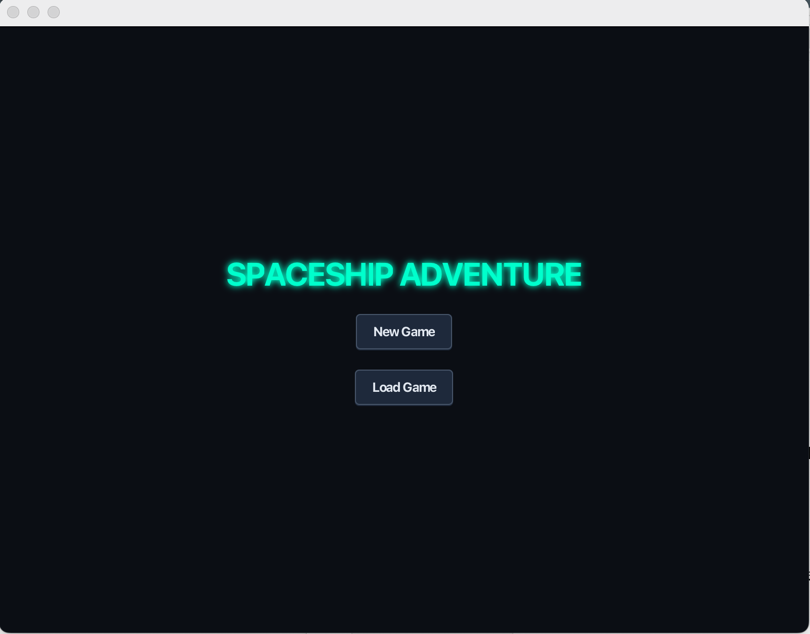
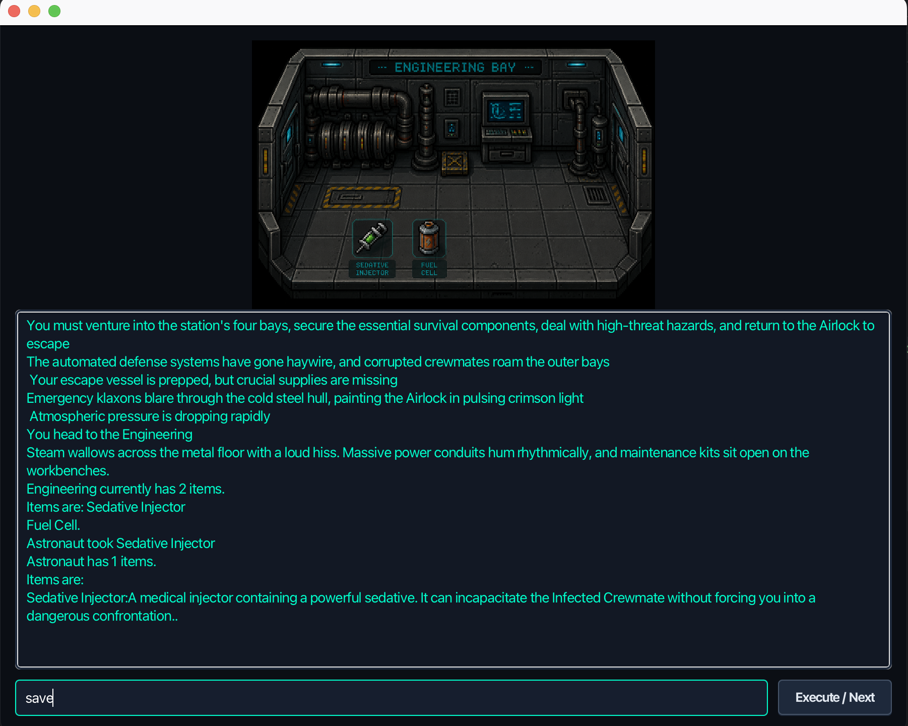
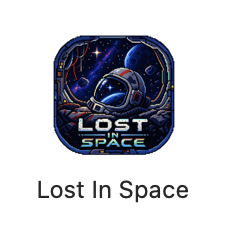

# Lost in Space

A text-based sci-fi adventure game built in Core Java, with a JavaFX interface on top. You wake up on an abandoned spaceship, explore its rooms, gather supplies, deal with a couple of things that are trying to kill you, and try to get back to the escape pod before you run out of health.



## What it does

- Navigate the ship with typed commands (`go north`, `take multitool`, `use tool`, `look`, `inventory`, `save`)
- A lightweight command parser normalizes different phrasings ("grab", "pick up", "take" all resolve to the same action)
- Two rooms hold enemies that can't be dealt with safely unless you've picked up the right item from elsewhere on the ship first
- Health, inventory, and enemy state are all tracked and persisted
- Save/load to a single save file, stored outside the app itself so it survives updates and reinstalls
- Packaged as a native macOS app — no terminal or Java installation required to run it



## Why it's built the way it is

The main thing I wanted out of this project, beyond just "make a text adventure," was to actually separate the game logic from the interface. The `engine` and `model` packages have zero knowledge that JavaFX exists — they could run behind a plain console, a web frontend, or anything else. `ui` is the only package allowed to import JavaFX classes.

That split turned out to matter in practice: I originally built the game against a Swing prototype, then switched to JavaFX partway through for the animations and styling, and didn't have to touch a single line of `model`, `engine`, or `io` code to do it.

```
src/main/java/
├── Model/       → Room, Item, Player, Enemy, Command, GameState (plain data, no framework code)
├── Engine/      → GameEngine, CommandParser, WorldBuilder (all the actual game logic)
├── IO/          → SaveManager (reads/writes the save file)
├── UI/          → SpaceshipApp, GameWindow, StartScreen (the only place JavaFX shows up)
└── utilities/   → StoriesBuilder, SynonymBuilder (loads intro/room text and command synonyms from file)
```

Every layer except `UI` has its own JUnit test suite, using small hand-built fake worlds rather than the real game content, so the tests check behavior and don't break every time I tweak a room description.

## Design decisions worth calling out

- **Command parsing is a rule-based synonym mapper, not NLP.** Raw input gets normalized, tokenized, filtered against a stop-word set, then matched against a synonym map (`Map<String, CommandType>`) to resolve intent. It's simple, but it's the right tool for the job here.
- **Player inventory is a `Map<String, Item>`, not a `List`.** Commands reference items by name ("use multitool"), so a name-keyed lookup made more sense than scanning a list.
- **Save files are a custom `key=value` text format**, not Java's built-in object serialization. It's more work, but it's human-readable (you can open a save file and actually see what's in it) and doesn't silently break if the class structure changes later.
- **Enemies aren't defeated with combat** — they're bypassed with the right item from an earlier room (a multitool to disable a drone, a sedative for an infected crewmate). Felt more in keeping with "realistic items on a spaceship" than a health-bar fight.

## Running it

You'll need a JDK (developed against JDK 21+) and Maven.

**Dev mode, with JavaFX handled automatically:**

```
mvn javafx:run
```

**Run the test suite:**

```
mvn test
```

## Building the standalone macOS app

This project ships as a native `.app` you can drop in `/Applications` — no Java installation needed on the machine that runs it, since the runtime is bundled in.

1. Build the jar:
   ```
   mvn clean package
   ```

2. Copy the jar into the input folder jpackage reads from:
   ```
   mkdir -p target/input
   cp target/spaceship-adventure.jar target/input/
   ```

3. Run jpackage (needs a full JDK — not just a JRE — with a `jmods` directory; check with `ls $JAVA_HOME/jmods`):
   ```
   jpackage \
     --type app-image \
     --input target/input \
     --dest target/dist \
     --name "Lost In Space" \
     --app-version 1.0.0 \
     --vendor "Yodishtr" \
     --main-jar spaceship-adventure.jar \
     --main-class UI.Main \
     --icon lost-in-space.icns \
     --module-path javafx-sdk \
     --add-modules javafx.controls,javafx.fxml,javafx.media
   ```

   `javafx-sdk` here is a folder containing the platform-specific JavaFX jars (`javafx-controls`, `javafx-graphics`, `javafx-base`, `javafx-fxml`, `javafx-media`) copied out of your local Maven repo (`~/.m2/repository/org/openjfx/`).

4. The finished app lands at `target/dist/Lost In Space.app`. Drag it into `/Applications` and launch it like any other Mac app.

Since this build isn't code-signed with an Apple Developer certificate, macOS Gatekeeper will flag it as coming from an unverified developer the first time you open it. Right-click the app → Open to get past that; it launches normally after.



## What I'd build next

- Code-signing and a proper `.dmg` installer
- Multiple save slots
- A couple more rooms and a second ending state
- Sound effects tied to specific actions (killing an enemy, picking up an item), using `javafx-media`

## Built with

Core Java 21 · JavaFX 21 · Maven · JUnit 5 · jpackage
